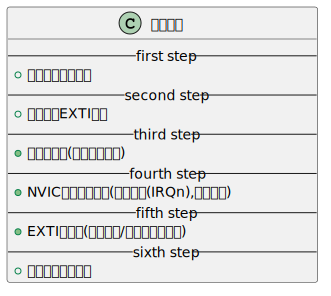
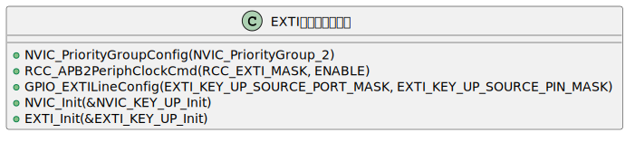
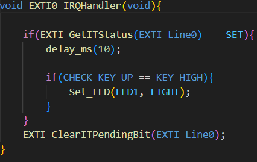
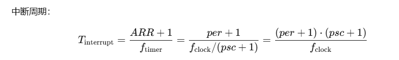

@auther 巷北  
@time 2025.10.16 19:34

# 简介
怎么说呢,中断这部分其实还是比较好玩的.这部分代码很早就先跟着视频写完了,但是当时并不理解.今天上午又重新理解,并且更新了自己的中断代码.可是,自己写的代码,一直存在个小问题,解决这个问题,花费了很长时间.但是中断的`debug`又不是那么的轻松,因为编译没问题,烧录后,硬件反馈不一致,所以总会怀疑,是不是某部分自己写的代码有问题,经过一系列的测试后,发现,都没问题,可是硬件反馈就是不行.  
那么最后问题是怎么解决的呢?总结了下,放到下面吧.

- [个人中断代码错因分析](#个人中断代码错因分析)
- [基本步骤](#基本步骤)
- [EXTI初始化函数汇总](#exti初始化函数汇总)
- [中断执行函数](#中断执行函数)
- [定时器中断](#定时器中断)

## 个人中断代码错因分析
- 不要只怀疑自己之前的代码,因为错因不可能只是这一个.可能错因如下.
    - 之前代码(概率小,因为之前实验没问题,恰好这里有问题?)
    - 当前新写的代码(仔细对照无误后,大概率也不是这个问题.)
    - 代码组合问题(最有可能的.新代码和老代码之间,通过接单的组合,不一定可以成功运行)
- 我的时间都浪费在了重新分析之前代码,一直对照自己写的新代码和答案,但是回过头来看的话,问题并不是出现在这里,可是时间都浪费掉了.
- 问题其实就是出现在代码组合问题上了.那么我们应该如何测试(`debug`)呢?
- 其实也很容易.就是测试极小化代码.极小化代码就是硬件反馈不一致部分代码+最低可执行该代码的代码.
- 看看这部分新代码是否可运行.能运行,最好,逐步添加代码,分析.不能运行,则说明,缺少新代码可执行代码.所以就需要分析逻辑了.这部分分析不出来也没问题,贴给`AI`,让它分析.
- 我的源代码,其实就是缺少了`KEY_Init()`初始化可执行项,导致新老代码无法兼容.添加之后就没问题了.
- 可看起来这么简单,其实找到这个点,却非常不容易.因为初始代码量很大,贴给`AI`,它也分析不出来.
- 后面我就用极小化代码测试,发现还是没有反馈,把问题贴给`AI`,就直接点明,先初始化`KEY_Init()`,后初始化`EXTI_Init()`.有这个逻辑关系.如果先初始化前者,就会有问题.
- 按照教程,基本不会存在这个问题.可是我自己写的代码,逻辑的不同,导致该问题的发生.
- 我自己的代码,添加了安全逻辑判断,就是假如忘了初始化的话,会自动初始化.所以,我并没有手动初始化`led`,`beep`,`key`等.其他输出端没问题,但是输出端的`key`,就会有问题.因为中断,就是根据这部分输入,而产生的.
- 由于我一开始没有初始化`key`,所以逻辑就成了先初始化`exti`,再往后进行.这样就会导致问题的发生.
- 回过头来看,本质,还是对中断不理解,这样自己`diy`代码的话,就很容易出现问题.
- 这也重新论证前面章节说的,软件知识要跟硬件知识匹配,一高一低,也会非常难搞,很难继续进行下去.

## 基本步骤

    

- 优先分组这里主要是为了确定中断优先级
- `EXTI`本身就是`MCU`端的一个外设,所以时钟需要使能.
- 这个中断线,其实就是确立关系.没有中断的话,我按下`key`,并不会产生中断.有中断映射,我按下`key`,输入信号可以通过寄存器,经过总线,传输到`NVIC`中,从而使`cpu`产生中断.所以这个配置,就是建立联系,`IO`与`cpu`之间的联系.
- `NVIC`是一个调控器,`EXTI`用来接收外部信号传递给`NVIC`,`NVIC`判断优先级,决定哪个给`cpu`.
- 最后再进行`EXTI`初始化.
- 上面整个初始化结束后,需要写对应函数,也就是中断`cpu`后,去执行的那个函数.

## EXTI初始化函数汇总

    

- 感觉也没必要说什么.相关参数我也不用多说了,怎么找,以前也说过.

## 中断执行函数

    

- 这个函数名,是自带的,似乎在汇编语言当中.就是告诉`cpu`,中断产生时,执行这个函数.
- 内部的`EXTI_GetITStatus()`,是固定的,就是得到`EXTI_Line0`这条线上的信号.
- 最后的`EXTI_ClearITPendingBit()`就是清除信号位.

> 写这个的时候,硬件部分还没有写.还是想先通过软件部分,去理解硬件部分.现在再去写写硬件部分,加深理解.

## 定时器中断

- 这个不知道放哪,想了想,还是放在这里吧.
- 上面是`EXTI`中断,但是不仅仅只有这些,其他很多外设都能中断.而`EXTI`中断只不过是自己映射`GPIO`
- 现在说的是定时器中断,比较简单,我们看看函数就行.
~~~C
void TIM4_Init(u16 per,u16 psc)
{
	TIM_TimeBaseInitTypeDef TIM_TimeBaseInitStructure;
	NVIC_InitTypeDef NVIC_InitStructure;
	
	RCC_APB1PeriphClockCmd(RCC_APB1Periph_TIM4,ENABLE);
	
	TIM_TimeBaseInitStructure.TIM_Period=per;   
	TIM_TimeBaseInitStructure.TIM_Prescaler=psc; 
	TIM_TimeBaseInitStructure.TIM_ClockDivision=TIM_CKD_DIV1;
	TIM_TimeBaseInitStructure.TIM_CounterMode=TIM_CounterMode_Up; 
	TIM_TimeBaseInit(TIM4,&TIM_TimeBaseInitStructure);
	
	TIM_ITConfig(TIM4,TIM_IT_Update,ENABLE); 
	TIM_ClearITPendingBit(TIM4,TIM_IT_Update);
	
	NVIC_InitStructure.NVIC_IRQChannel = TIM4_IRQn;
	NVIC_InitStructure.NVIC_IRQChannelPreemptionPriority=2;
	NVIC_InitStructure.NVIC_IRQChannelSubPriority =3;	
	NVIC_InitStructure.NVIC_IRQChannelCmd = ENABLE;			
	NVIC_Init(&NVIC_InitStructure);	
	
	TIM_Cmd(TIM4,ENABLE); 
}

void TIM4_IRQHandler(void)
{
	if(TIM_GetITStatus(TIM4,TIM_IT_Update))
	{
		LED2=!LED2;
	}
	TIM_ClearITPendingBit(TIM4,TIM_IT_Update);	
}
~~~
- 定时中断公式如下.

    

- `psc`是预分屏器.上面函数配置选项之一,也是用户传入参数之一.
- `per`是定时计数器,也就是`arr`.当计数器达到`arr`时,会产生中断,并清零,重新计数.
- 示例代码传参就是`TIM4_Init(1000,36000-1);`,根据公式算得定时`500ms`(初始化时钟频率为`72MHZ`),也就是每`500ms`中断一次.
- 中断时执行最下面的函数,可以看到,效果也是让小灯闪烁.
> 其它的也不多说,就这么多吧.