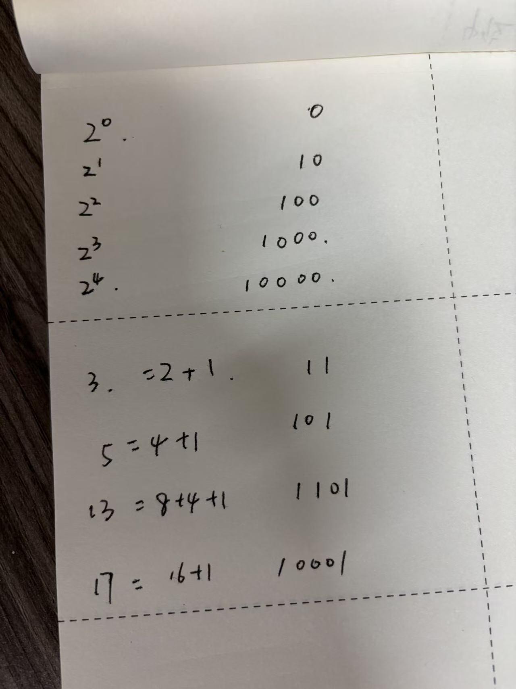

@author 巷北  
@time 2025.10.18 11:36
# 简介
这里主要存放写进制之间的转换技巧,帮助快速理解非十进制数的复杂运算,并且能迅速计算所得结果.

- [快速口算十进制转二进制](#快速口算十进制转二进制)
- [快速口算十六进制转二进制](#快速口算十六进制转二进制)
- [&运算符应用](#运算符应用)

## 快速口算十进制转二进制
- 这些天分析库对应函数时,发现看到十进制数,转二进制还需要手写一个一个列出来,速度太慢.比如看到`3`,`4`,`5`这些数,没有技巧,只能单列.
- 不过我知道,一定有快速运算方式,所有请教了一下`gpt`,果然还是非常有用的.

    

- 第一个`2^0`应该对应的是`1`,写错了...
- 上述图片可见,对于`2^n`,`n`对应的是左移位数,跟`C`相关连起来了.
- 左侧对应的数是`1 2 4 8 16 32 ...`,这些都是对应十进制数,而右侧则是其对应二进制数.
- 可以很清晰地看出来,这些特殊十进制数,对应的二进制也十分特殊,恰好是刚进位的数.
- 我们可以根据这些特点,来巧妙快速计算十进制对应二进制数.
- 当前,前提是对`1 2 4 8 16 ...`这些二进制数要熟悉.但其实也不难,技巧上面也说了.
- 所以,对于`3`而言,可以拆分成`1 2`,`2`是`10`,`1`是`1`,相加就为`11`了.其它同理.
- 说到这里,我想到了`图灵测试`游戏中,有过这方面的内容章节,就是将十进制数快速拆分成`1 2 4 8 16 ...`这些数组成的数,但不过当时不明白什么意思,可是现在似乎完成了闭环...
- 关于二进制转十进制,不用多说了,太熟悉了.
## 快速口算十六进制转二进制
- 十六进制的特殊性,其`1`位可以用`4`位二进制数表示,这就非常方便.
- 有了上面十进制转二进制的技巧后,十六进制转二进制也就很容易了.
- 首先将十六进制数,转换为十进制,然后再按照十进制转二进制表示就好了.不过需要注意,位数需要补齐四位.
- 比如`0x3A`,其中`3 A`对应十进制数分别为`3 10`,那么二进制数就是`0011 1010`.
- 关于二进制转十六进制,每四位转换就行,不足的就补0

## &运算符应用
- 关于`&`运算符,除了`&=`外经常用到外,在我经常查看库函数后,又发现其有很多应用技巧.
- 比如我想获得低四位数,可以采用`A & (0x0F)`,直接获取了`A`的低`4`位
- 同理,低`8`位则直接`& (0xFF)`.
- 在`if`判断中,我如果只想判断`A`寄存器的`3 5 7`位,也可以使用`&`运算符直接判断.操作如下:
    - 将`3 5 7`位换为二进制数,然后再换为十六进制即可(因为`C`中一般用十六机制表示)
    - 即`10101000`.注意包括`0`位,然后将判断位数设为`1`即可.
    - 对应十六进制为`0xA8`,即需要判断(`A & (0xA8)`)
- 所以对于下面这个`if`判断语句,判断的是第几位呢?
~~~C
if ((((uint32_t)GPIO_InitStruct->GPIO_Mode) & ((uint32_t)0x10)) != 0x00)
~~~
- 这个存在的目的,主要是判断位,并不是掩码位.