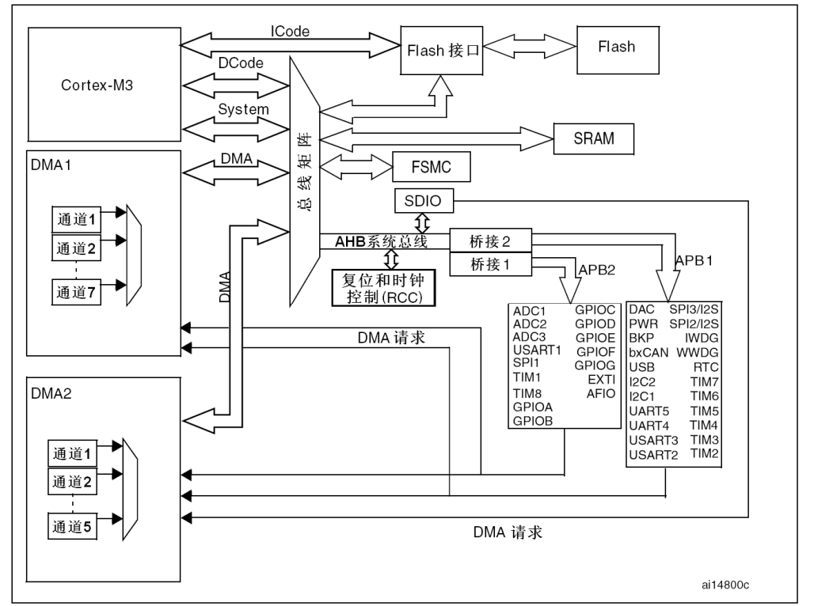

@auther 巷北  
@time 2025.10.15 13:28
# 简介

- 目前仍停留在实验十这部分.软件方面(C语言,函数库,keil,vscode配套使用)问题几乎已经都解决了,但是硬件方面知识并没有对应提升.这种情况下,继续往下进行,还是异常艰难的.
- 思来想去,还是没有将硬件和软件建立起映射关系.但是映射关系的建立,又需要明确硬件相关知识与软件相关知识.软件没有问题,需要弥补的是硬件知识.这也是创建这个文档的目的.
- 其实普中的视频,做的没有任何问题,先讲原理,再编写代码.但对于我个人而言,原理一上来是看不明白的,只能先写代码,看看什么个样,再通过代码理解原理.刚开始的时候,是硬件不懂,软件也不懂,才这么干的.可现在软件懂了,那么前面遗留的硬件问题,需要重新学习,分析,才能匹配软件方面理解的高度,继续往下进行则会越来越明确.否则,软硬件知识不在一个量级上面,往下进行,没有任何的意义.
- 等硬件知识弥补过来后,需要重新建立学习方案,不可能一直这么进行下去.随时迭代,版本更新,才能找到适合自己的学习方式.

---
- [目前问题](#目前问题)
- [系统架构](#系统架构)
    - [芯片(MCU)](#芯片mcu)
    - [闪存(FLASH)及SRAM](#闪存flash及sram)
    - [总线](#总线)
    - [时钟(RCC)](#时钟rcc)
    - [存储器与寄存器](#存储器与寄存器)

## 目前问题
今早又大体看了看手册,解决了部分困惑.所以这里的问题就说说截止目前,让我感到受阻的点吧.
- 库函数中某些函数名,不知道什么作用,或者是说,含义不清.比如`RCC_...ENR`.
- 芯片专有名词简称(英文),不知道什么意思,或者对应着什么,或者一个东西有多个名词指代,让我感到比较混乱.
- 内部实现原理.比如`GPIO`

## 系统架构

    

架构这部分,我就说说目前我知道的.不知道的,等后面学习的时候,结合架构图,也能清晰明白其逻辑对应关系

### 芯片(MCU)

- 上面整个图片,就是一个完整芯片,也可以称为`MCU`,也叫做单片机.
- 虽然是这么说,但要明确不同.
    - `MCU`,英文全称`Microcontroller Unit`,翻译过来就是微控制器单元.它通常包含`CPU`(中央处理器),存储器(`FLASH`(程序存贮),`SRAM`(数据存储)),外设(`GPIO`,`ADC`,定时器等),时钟,电源管理,复位电路等模块.
    - 工程师常说 `MCU`,中文教材常说 单片机,普通人可能会说 芯片.
    - **`MCU` = 单片机 = 一块芯片(里面有`CPU`, 存储, 外设)**

- 图中的`Cortex-M3`是`CPU`,也就是中央处理器,是由`ARM`公司设计的.
- 图中这个整体,是一块芯片,由`ST`公司设计.其中,中央处理器由`ARM`公司授权,`ST`公司结合该`CPU`设计的整体架构.

### 闪存(`FLASH`)及`SRAM`
- `FLASH`用于存储程序(机器指令), `SRAM`存储临时数据,变量,函数栈,`CPU`中间计算结果等.
- `FLASH`掉电不丢失,`SRAM`会丢失.
- 烧录时,程序会存储到`FLASH`,`MCU`上电后,`CPU`会从`FLASH`中读取机器指令并执行,然后将部分数据存储到`SRAM`中保存.
- `FLASH`有擦写寿命年限.

### 总线
- 图中`ICODE`,`DCODE`,`System`,`DMA`,这些都是代表的总线.这部分中文参考手册有解释,这里不再重复.
- 从图中也可以看出,`AHB`总线与`APB2`总线,`APB1`总线之间的关系.
- `APB2`总线上,连接着许多外设,可以直观地看出对应联系.像常用的`GPIOx`, 中断`EXTI`,通用计时器`TIM`,这些都在`APB2`总线上.后续遇到不明确的地方,可以来这里找找,它主要是在哪里,便于理解和学习.

### 时钟(`RCC`)
- 从图中也能看出,总体时钟控制,是在`AHB`总线上,但是依然可以向下(`APB2`,`APB1`)使能或禁止时钟.

### 存储器与寄存器
- 存储器用来存放程序或数据,比如`FLASH`,`SRAM`,外部存储等.
- 寄存器有以下三类.
    - `CPU`内部寄存器.这部分不分析,因为我们分析的是芯片,`CPU`相关接口是由`ST`利用的,并提供接口,给用户(普中,正点,野火帮等单片机公司)使用的.上述公司结合`ST`公司提供的芯片,制作出对应'板子',再供我们大众使用.
    - 外设寄存器.后面说到`GPIO`时,会专门强调.
    - 系统寄存器.这里包括`NVIC`,`SysTick`,`SCB`,`MPU`等.关于`NVIC`和`SysTick`,其实已经学习了,但是原理没懂,也不清楚其与`GPIO`的不同,而且也不知道它是什么.但到了这个部分,架构上有了一定的认识.
    - 当然,这颗芯片还有其它寄存器,比如电源寄存器等等,这些并不是我们关心的,了解就好.我们目前关心的是使用好外设寄存器,系统寄存器.
- 寄存器是存储器的一种特化形式:小,快,专用,通常用于CPU内部控制或外设控制,而存储器(Flash、SRAM)容量大,通用,用于存放程序和运行数据.
- `CPU`通过总线与存储器和寄存器交互.
- 每个寄存器都有一个"虚拟内存地址",CPU 读写这个地址就相当于操作寄存器.
- 每个外设几乎都会有寄存器,也都有`CPU`映射地址,`CPU`访问该地址,可以直接通过总线,访问该地址映射的外设.
- 所以说,地址信息是由`ST`公司自己设立划分的,库函数相关的宏,是结合地址信息定义的,背过记住这些地址信息没有任何意义,因为这些内容只对`stm32f10x`系列芯片有用,其他系列芯片,地址信息完全改变,肯定不会一一对应.应该学会如何理解,而不是什么都要背过.
