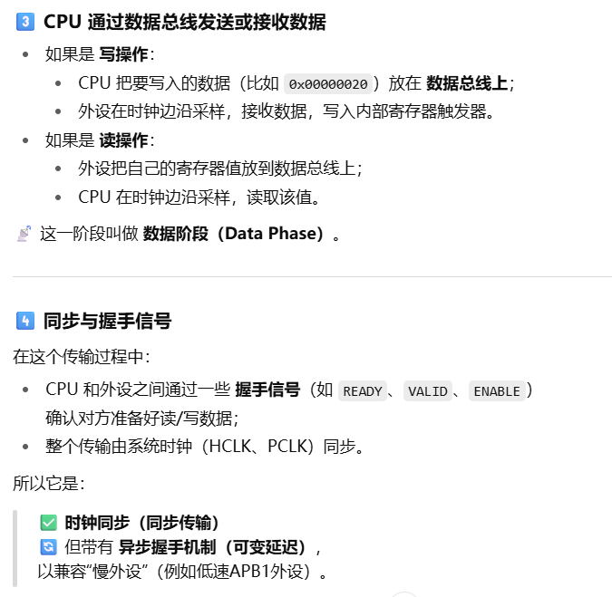

@auther 巷北  
@time 2025.10.15 13:28
# 简介

- 目前仍停留在实验十这部分.软件方面(C语言,函数库,keil,vscode配套使用)问题几乎已经都解决了,但是硬件方面知识并没有对应提升.这种情况下,继续往下进行,还是异常艰难的.
- 思来想去,还是没有将硬件和软件建立起映射关系.但是映射关系的建立,又需要明确硬件相关知识与软件相关知识.软件没有问题,需要弥补的是硬件知识.这也是创建这个文档的目的.
- 其实普中的视频,做的没有任何问题,先讲原理,再编写代码.但对于我个人而言,原理一上来是看不明白的,只能先写代码,看看什么个样,再通过代码理解原理.刚开始的时候,是硬件不懂,软件也不懂,才这么干的.可现在软件懂了,那么前面遗留的硬件问题,需要重新学习,分析,才能匹配软件方面理解的高度,继续往下进行则会越来越明确.否则,软硬件知识不在一个量级上面,往下进行,没有任何的意义.
- 等硬件知识弥补过来后,需要重新建立学习方案,不可能一直这么进行下去.随时迭代,版本更新,才能找到适合自己的学习方式.

---
- [目前问题](#目前问题)
- [系统架构](#系统架构)
    - [芯片(MCU)](#芯片mcu)
    - [闪存(FLASH)及SRAM](#闪存flash及sram)
    - [总线](#总线)
    - [时钟(RCC)](#时钟rcc)
    - [存储器与寄存器](#存储器与寄存器)
- [复位和时钟控制(RCC)](#复位和时钟控制rcc)
    - [复位](#复位)
    - [系统时钟](#系统时钟)
    - [时钟树](#时钟树)
    - [RCC寄存器概要](#rcc寄存器概要)
- [GPIO/AFIO](#gpioafio)
    - [GPIO输入](#gpio输入)
    - [GPIO输出](#gpio输出)
    - [GPIO复用](#gpio复用)
    - [GPIO模拟输入](#gpio模拟输入)
    - [GPIO寄存器概要](#gpio寄存器概要)
- [中断和事件](#中断和事件)
    - [EXTI寄存器概要](#exti寄存器概要)
- [cpu数据分发逻辑](#cpu数据分发逻辑)
    - [寄存器](#寄存器)
    - [信息发送](#信息发送)
    - [地址划分](#地址划分)

## 目前问题
今早又大体看了看手册,解决了部分困惑.所以这里的问题就说说截止目前,让我感到受阻的点吧.
- 库函数中某些函数名,不知道什么作用,或者是说,含义不清.比如`RCC_...ENR`.
- 芯片专有名词简称(英文),不知道什么意思,或者对应着什么,或者一个东西有多个名词指代,让我感到比较混乱.
- 内部实现原理.比如`GPIO`

## 系统架构

    

架构这部分,我就说说目前我知道的.不知道的,等后面学习的时候,结合架构图,也能清晰明白其逻辑对应关系

### 芯片(MCU)

- 上面整个图片,就是一个完整芯片,也可以称为`MCU`,也叫做单片机.
- 虽然是这么说,但要明确不同.
    - `MCU`,英文全称`Microcontroller Unit`,翻译过来就是微控制器单元.它通常包含`CPU`(中央处理器),存储器(`FLASH`(程序存贮),`SRAM`(数据存储)),外设(`GPIO`,`ADC`,定时器等),时钟,电源管理,复位电路等模块.
    - 工程师常说 `MCU`,中文教材常说 单片机,普通人可能会说 芯片.
    - **`MCU` = 单片机 = 一块芯片(里面有`CPU`, 存储, 外设)**

- 图中的`Cortex-M3`是`CPU`,也就是中央处理器,是由`ARM`公司设计的.
- 图中这个整体,是一块芯片,由`ST`公司设计.其中,中央处理器由`ARM`公司授权,`ST`公司结合该`CPU`设计的整体架构.

### 闪存(`FLASH`)及`SRAM`
- `FLASH`用于存储程序(机器指令), `SRAM`存储临时数据,变量,函数栈,`CPU`中间计算结果等.
- `FLASH`掉电不丢失,`SRAM`会丢失.
- 烧录时,程序会存储到`FLASH`,`MCU`上电后,`CPU`会从`FLASH`中读取机器指令并执行,然后将部分数据存储到`SRAM`中保存.
- `FLASH`有擦写寿命年限.

### 总线
- 图中`ICODE`,`DCODE`,`System`,`DMA`,这些都是代表的总线.这部分中文参考手册有解释,这里不再重复.
- 从图中也可以看出,`AHB`总线与`APB2`总线,`APB1`总线之间的关系.
- `APB2`总线上,连接着许多外设,可以直观地看出对应联系.像常用的`GPIOx`, 中断`EXTI`,通用计时器`TIM`,这些都在`APB2`总线上.后续遇到不明确的地方,可以来这里找找,它主要是在哪里,便于理解和学习.

### 时钟(`RCC`)
- 从图中也能看出,总体时钟控制,是在`AHB`总线上,但是依然可以向下(`APB2`,`APB1`)使能或禁止时钟.

### 存储器与寄存器
- 存储器用来存放程序或数据,比如`FLASH`,`SRAM`,外部存储等.
- 寄存器有以下三类.
    - `CPU`内部寄存器.这部分不分析,因为我们分析的是芯片,`CPU`相关接口是由`ST`利用的,并提供接口,给用户(普中,正点,野火帮等单片机公司)使用的.上述公司结合`ST`公司提供的芯片,制作出对应'板子',再供我们大众使用.
    - 外设寄存器.后面说到`GPIO`时,会专门强调.
    - 系统寄存器.这里包括`NVIC`,`SysTick`,`SCB`,`MPU`等.关于`NVIC`和`SysTick`,其实已经学习了,但是原理没懂,也不清楚其与`GPIO`的不同,而且也不知道它是什么.但到了这个部分,架构上有了一定的认识.
    - 当然,这颗芯片还有其它寄存器,比如电源寄存器等等,这些并不是我们关心的,了解就好.我们目前关心的是使用好外设寄存器,系统寄存器.
- 寄存器是存储器的一种特化形式:小,快,专用,通常用于CPU内部控制或外设控制,而存储器(Flash、SRAM)容量大,通用,用于存放程序和运行数据.
- `CPU`通过总线与存储器和寄存器交互.
- 每个寄存器都有一个"虚拟内存地址",CPU 读写这个地址就相当于操作寄存器.
- 每个外设几乎都会有寄存器,也都有`CPU`映射地址,`CPU`访问该地址,可以直接通过总线,访问该地址映射的外设.
- 所以说,地址信息是由`ST`公司自己设立划分的,库函数相关的宏,是结合地址信息定义的,背过记住这些地址信息没有任何意义,因为这些内容只对`stm32f10x`系列芯片有用,其他系列芯片,地址信息完全改变,肯定不会一一对应.应该学会如何理解,而不是什么都要背过.

> 宏观结构似乎就这么多.接下来我们将具体分析对应内容.目前而言,个人理解有限,但是理解是随时提升的,所以这部分内容,也只是代表着当前的理解.

## 复位和时钟控制(RCC)
- `RCC`英文全称`Reset and Clock Control`,翻译过来就是复位和时钟控制.
### 复位

    

- 其中复位,代表着整个`MCU`或者单个外设(`LED`灯等)恢复初始化状态.复位后,整个寄存器的值,变为默认值,外设停止工作,`CPU`回到起始状态.上图是复位原理图,贴在这里吧,目前看不懂.

### 系统时钟
- 时钟控制则是管理`MCU`内部和外设的时钟信号,选择和控制系统时钟,外设时钟,`PLL`等.决定`CPU`和外设的运行速度.
- 因此,`RCC`相当于`MCU`的开关,并且是节奏控制器.
- `RCC`本身就是一个外设寄存器模块,控制系统时钟(`HSI`内部高速晶振,`HSE`外部晶振,`PLL`),进行时钟分频(`CPU`,总线(`AHB`, `APB`),外设等)
- 总结来看,`RCC`(复位和时钟控制)是 `STM32 MCU `的核心模块,用于管理系统和外设的复位状态以及`CPU`和外设的时钟信号,保证 MCU 正常启动,运行和节能.
- 下面再来详细解释一下上面的一些名词含义.
    - 系统时钟(`SYSCLK`),包含`HSI`(内部高速时钟), `HSE`(外部高速时钟), `PLL`(`PLL`输出)
    - `HSI` 和 `HSE` 不是 `CPU` 核心的一部分,它们是时钟源:`CPU` 的指令执行,寄存器操作都依赖于 `SYSCLK`,但 `HSI/HSE` 是 `RCC` 控制的.
    - `HSI`开机即可启动,但有些许误差,`HSE`精度高,适合对频率严格的.`PLL`是前两者频率的放大器
    - `HSI`是`MCU`内部就自带的时钟源,可被`RCC`寄存器控制(对外产生接口),但只能使能或禁止,没有引脚让外部直接控制,频率几乎不可调节.而`HSE`是`MCU`外部的时钟源,有引脚,也是被`RCC`控制,可以自定义调节频率.`PLL`(`Phase-Locked Loop`,锁相环),用来倍频或分频输入时钟(`HSI` 或 `HSE`),输出稳定的高频 `SYSCLK`.
    > 总结来看:
    🔹 `HSI` 是 `MCU` 内部固定频率的振荡源,只能通过寄存器启用/关闭,但不能外部干预;
    🔹 `HSE` 是外部晶振/时钟源,可以通过引脚接入外部信号,并用寄存器控制启用,旁路或倍频.
    - 注意,`RC`是指电阻-电容振荡器,一般就是代表`HSI`内部时钟.比如`HSI_RC`.

### 时钟树
- 在此基础上,我们来看看下面的时钟树.

    

- 系统启动默认时钟源是`HSI`,初始默认频率为`8MHZ`,`PLL`,`HSE`为关闭状态.
- 下方低速时钟信号,`LSI`,`LSE`,这些频率很低,都是多少`KHZ`,不是为`CPU`设计提供的,而是一些后台系统准备的.
- 图中梯形的是振荡器,圆头的是'放大器'(`PLL`将频率放大,而不是将电压电流放大.自己推测的).
- `RTC`时钟,是除系统时钟(`SYSCLK`,也可以说是`CPU`时钟)之外的一个时钟,指当`MCU`的主`CPU`,外设,总线都掉了的时候,仍然能走的时钟.来源可以是`LSE`, `LSI`, `HSE`.备份电源有电,当整体没电的时候,`RTC`时钟依然可以计时.
### `RCC`寄存器概要
文档中这里给了地址,简要分析,我这里只写出相关寄存器英文中文名,留个念想,以后库中可能会经常看到.
- 时钟控制寄存器(`RCC_CR`)
- 时钟配置寄存器(`RCC_CFGR`)
- 时钟中断寄存器 (`RCC_CIR`)  
- `APB2` 外设复位寄存器 (`RCC_APB2RSTR`) 
- `APB1` 外设复位寄存器 (`RCC_APB1RSTR`) 
- `AHB`外设时钟使能寄存器 (`RCC_AHBENR`) 
- `APB2` 外设时钟使能寄存器(`RCC_APB2ENR`) 
- `APB1` 外设时钟使能寄存器(`RCC_APB1ENR`) 
- 备份域控制寄存器 (`RCC_BDCR`) 
- 控制/状态寄存器 (`RCC_CSR`) 

## GPIO/AFIO
- `GPIO`,英文全称`General Purpose Input/Output`通用输入输出端口.`AFIO`,英文全称`Alternate Function I/O`,复用功能输入输出.
- `GPIO`是`MCU`的引脚控制器,负责每个引脚的输入,输出电平状态,模式匹配等基本功能.
- 而`AFIO`,则是除了基本的输入输出外,还能复用的外设功能引脚,比如`ADC`,`TIM`,`USART`,`SPI`,`I2C`等.`AFIO`是`GPIO`的拓展.
    - `AFIO`可以引脚重映射,让外设在不同引脚工作.
    - 外部中断通道选择(`EXTI`).每个`EXTI`可以在不同引脚工作.
    - 调试接口配置.
- 关于`GPIO`,有很多模式,我目前用到的只有推挽输出,上拉输入,下拉输入.其他的一些模式,没有实际应用,单纯看也看不懂.我这里就不再细致描述.
- `GPIO`详解图如下.

    

- 看不懂也没事.先来解释一下片上外设什么意思.集成在 `MCU` 芯片内部的功能模块(`Peripheral`),通过寄存器接口提供特定功能.`MCU` = `CPU`+存储器+片上外设+`IO`引脚.
- 先找到右侧`IO`引脚,这就是面向用户的.该引脚,可能连接`led`,`beep`,`key`等`MCU`外部外设(注意区分内部外设).
- 我们所谓的输入输出模式,是`CPU`相对于`GPIO`的,而不是`IO`接口相对于用户的.
    - 为什么呢?比如上拉输入,下拉输入,上拉是高电平,`IO`端为低电平,此时相当于向`IO`端输出,怎么会称为上拉输入呢?不过按照这个逻辑,下拉输入没有问题.
    - 所以,这里的输入输出模式,是相对于`CPU`而言,并不是用户端.

### `GPIO`输入
- `GPIO`输入时,模拟图如下.

    

- 我们只分析上拉输入和下拉输入.
- 图中`TTL`触发器,是一个只能输出`0`或`1`的器件.
- 程序部分,用户选择上拉输入时,触发器被激活,上拉开关连接(图中不知道怎么连接的).`IO`端口接地(比如有个`KEY`,一端接地,一端接`IO`,`KEY`按下,电路激活),会有高电平传送到触发器,触发器将信号转为`1`,传送到输入数据寄存器,然后输入到`CPU`.
- 上下两个开关,手册称为弱上拉和弱下拉,不知道什么意思.
- 下拉输入同理.不过浮空输入还没用过.算了,`ai`一下,看看啥情况.
- 浮空就是上下俩开关不闭合.应用场景目前还不知道.
### `GPIO`输出
- `GPIO`输出时,模拟图如下

    

- 此时`GPIO`输出缓冲器被激活,触发器也被激活.
- 推挽或开漏的不同,是输出寄存器输出`1`,推挽会闭合`P-MOS`,开漏会成为高组态模式(不闭合`P-MOS`).输出`0`,二者都会闭合`N-MOS`.
- 推挽输出,会输出输出数据寄存器的最后一次写的值.(其实就是,`0`输出低电平,`1`输出高电平,此时的输出是向`IO`口输出,不是`CPU`输出,其实也没问题,因为本来就是`CPU`发送信息到输出数据寄存器,然后经过输出控制,来控制上下开关.)
- 开漏输出,对输出数据寄存器的读访问得到最后一次写的值.我也看不懂.搜了搜,置`0`时为`0`,置`1`时浮空,不确定,外部有上拉电阻(就是外接高电平)时置`1`.注意,这里的`0/1`是寄存器输出到输出数据寄存器中的.
- 开漏输出的意义,是短路.比如`I^2C`,共享信号线,电平转换等.
### `GPIO`复用
- 复用功能配置图如下

    

- 后面遇到在解释吧.
### `GPIO`模拟输入
- 模拟输入配置图如下

    

- 同上.

### `GPIO`寄存器概要
- 端口配置低寄存器(`GPIOx_CRL`) (`x=A..E`)
- 端口配置高寄存器(`GPIOx_CRH`) (`x=A..E`) 
- 端口输入数据寄存器(`GPIOx_IDR`) (`x=A..E`) 
- 端口输出数据寄存器(`GPIOx_ODR`) (`x=A..E`)
- 端口位设置/清除寄存器(`GPIOx_BSRR`) (`x=A..E`)
- 端口位清除寄存器(`GPIOx_BRR`) (`x=A..E`)
- 端口配置锁定寄存器(`GPIOx_LCKR`) (`x=A..E`)

## 中断和事件

- 注意`EXTI`也是外设,可以看上面的总体图.
- `EXTI`会跟对应`GPIO`端口`pin`脚建立联系,通过`EXTI0`等中断映射线建立的.这些联系是用户自己配置的.
- 需要注意,`pin0-pin4`有对应的`EXTI0-EXTI4`中断线,也有对应执行的中断函数.剩下的`pin`也中断线,但不是一一对应的关系.
- 当`GPIO`输入某信号,会将该信息沿着中断线,传递至`EXTI`中断控制器中.然后中断控制器判断是否满足条件,满足的话,会继续将信息传递至`NVIC`,`NVIC`分析中断优先级,然后再传递至`cpu`,`cpu`会执行对应中断函数.
    - 那么`cpu`如何执行中断函数呢???
    - `flash`起始部分有中断向量表,存放着各中断如何地址.当`cpu`遇到中断时,会直接去这里找.
    - 所以中断函数名都是固定的,我们需要某中断,设置好初始化信息后,可以直接编写对应函数.
    - `PC`叫做程序计数器,普通代码执行,`PC`会增加.当遇到中断时,`PC`会被`NVIC`指向中断函数地址(也就是上面的中断想来那个表)
    - `PC`就相当于一个指针,指引`CPU`下一条指令去哪.
- `NVIC`并不存放向量映射,只是判断中断是否合法,分析中断优先级.

### `EXTI`寄存器概要

- 中断屏蔽寄存器(`EXTI_IMR`) 
- 事件屏蔽寄存器(`EXTI_EMR`) 
- 上升沿触发选择寄存器(`EXTI_RTSR`) 
- 下降沿触发选择寄存器(`EXTI_FTSR`) 
- 软件中断事件寄存器(`EXTI_SWIER`) 
- 挂起寄存器(`EXTI_PR`) 

## `cpu`数据分发逻辑

目前来看,稍微有些混乱.现在打算重新弄一个地址,掩码,值.从底层明确起原理.然后呢,设立好自己的逻辑框架,每当学习新的内容时,就在该逻辑框架上添加东西,明确数据的传输链路,从而从底层明白其原理.

### 寄存器
- 寄存器到底是什么呢?它在数据分发过程中,起着什么作用呢?
- 寄存器,英文名称为`Register`,`cpu`内部寄存器有`R0~R15`(以`stm32`为例)等.
- `cpu`内部,所谓寄存器的值,是`32`位的二进制码,每一位,可以代表一个状态(比如高低电平),`cpu`内部也可以作为存储临时数据,地址等容器.
- 所以,在`C`中经常看到的`1<<5`,其实就是将`bit5`位,置`1`,如果该位控制小灯开关,置`1`为点亮的话,那么`1<<5`相当于打开开关.
- 当`cpu`通过计算,得出某地址的值后,相关信息如何发送呢?

### 信息发送
- 下图就说明了信息发送的逻辑.

    

- `cpu`内部有寄存器,同理,各个外设也有自己的寄存器,且该寄存器配有地址,方便`cpu`寻址.
- `cpu`计算信息(计算结果)通过总线传递给外设寄存器后,外设寄存器会更新其值(一般也是`32`位二进制数),进而起到控制外设的目的.
- 所以,寄存器作用很广泛,一方面可以存储我们的信息(地址),另一方面,也可以作为开关,控制我们的行为.
- 那么外设的地址是如何确定的呢?既然是人为规定,那`cpu`如何精准定位该外设寄存器的呢?

### 地址划分

    

- 总线上都有基地址.可是总线不就是一根线吗?为什么会有地址呢?
- 总线上有很多外设,而外设都会有自己的地址.这些外设的地址是有条理划分的,所以将总线地址模块化,每个模块存放一个外设,外设内部又根据该模块地址,详细划分出其内部寄存器地址.
- 总线地址的模块化,其实就是划分出了一个又一个的总线基地址,每个基地址都是顺次的,而且都有自身对应外设,从而条理划分地址.

    

    

- 有了这些知识后,我们再去回看一下点亮`led`底层实现原理吧.